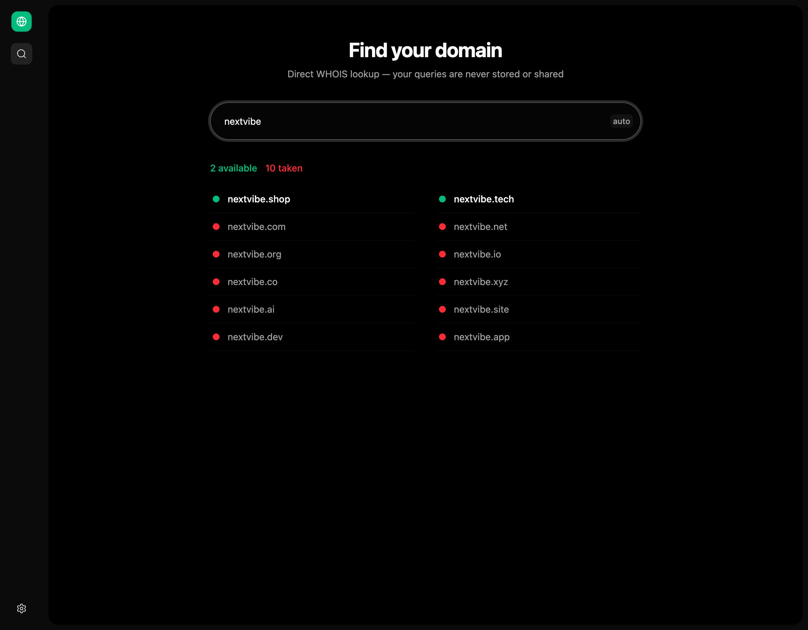

<h1 align="center" style="border-bottom: none;">Domain Checker</h1>
<h3 align="center" style="margin-top: 0; font-weight: normal;">
  Private domain availability lookup across 12 TLDs
</h3>

<p align="center">
  
</p>


<p align="center">
  <a href="https://opensource.org/licenses/mit">
    
  </a>
</p>


## What It Does

Type a domain name and instantly see availability across 12 TLDs. Lookups go directly to WHOIS/RDAP servers — your queries are never stored or shared, so there's zero risk of front-running.

**Supported TLDs:** `.com` `.net` `.org` `.io` `.dev` `.app` `.co` `.xyz` `.ai` `.shop` `.site` `.tech`

## How It Works

The backend uses a three-tier lookup strategy for authoritative results:

1. **WHOIS** (TCP port 43) — Primary method for 10 TLDs. Queries authoritative WHOIS servers directly.
2. **RDAP** (HTTP) — Used for TLDs without WHOIS servers (`.dev`, `.app`). Queries the registry's RDAP endpoint directly.
3. **DNS** (fallback) — Last resort if WHOIS/RDAP are unreachable. Checks A/AAAA/NS records. Less authoritative since registered domains with no DNS records appear available.

All 12 TLDs are checked concurrently. Results are sorted with available domains first.

### UI Indicators

- **Green dot** — Available (WHOIS or RDAP confirmed). Click to copy domain to clipboard.
- **Yellow dot** — Likely available (DNS-inferred, less certain). Click to copy with "likely" label.
- **Red dot** — Taken.
- **Gray dot** — Unknown/loading.

## Quick Start

```bash
npm run install-all
npm run start
```

Frontend runs at `http://localhost:5173`, backend at `http://localhost:8000`.

## Development

```bash
npm run start          # Start both frontend and backend
npm run front          # Frontend only (Vite on :5173)
npm run server         # Backend only (Hono on :8000)
npm run build          # Production build
```

## Project Structure

```
domain-checker/
├── src/
│   ├── components/
│   │   └── HomeView.jsx    # Domain checker UI
│   ├── assets/
│   │   └── styles.css      # Theme overrides
│   ├── main.jsx            # Route config
│   └── constants.json      # App config
├── backend/
│   ├── server.js           # Hono server + domain lookup logic
│   ├── adapters/           # Database adapters
│   └── config.json         # Backend config
├── package.json
└── vite.config.js
```

## Tech Stack

| Technology | Purpose |
|---|---|
| React 19 | Frontend UI |
| Vite 7.1 | Build & dev server |
| Tailwind CSS 4 | Styling |
| skateboard-ui | Application shell framework |
| Hono | Backend HTTP server |
| Node.js `net` | Raw TCP WHOIS queries |
| Node.js `dns` | DNS resolution fallback |

## API

### `POST /api/check`

Check domain availability across all supported TLDs.

**Request body (JSON):**
- `domain` — Base domain name (alphanumeric + hyphens, max 63 chars)

**Response:**
```json
[
  {
    "tld": "com",
    "domain": "example.com",
    "available": false,
    "status": "taken",
    "method": "whois"
  },
  {
    "tld": "dev",
    "domain": "example.dev",
    "available": true,
    "status": "available",
    "method": "rdap"
  }
]
```

**Method values:** `whois`, `rdap`, `dns`

## License

MIT License — see [LICENSE](LICENSE) for details.
